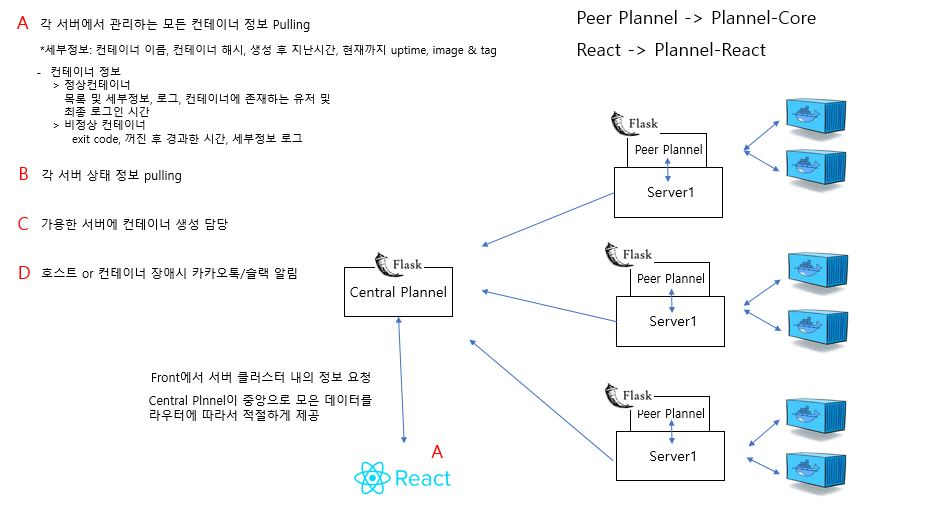

### Plannel (https://github.com/DGU-AILab/Plannel)
 

개발진행 상황: 준비단계 
목적: Linux Docker container 관리 시스템  
기능:   
* 컨테이너 HealthCheck 
* Linux user 별 사용 기록 저장 및 조회 
* CPU 및 Memory,GPU 사용량 수집
* 장애시 카카오톡/메일 알림 메세지 전송  
* 수집한 정보를 보여주는 웹 프론트/백엔드 구축 

이 외에 지속적으로 추가 예정 ... 

기술스택: 
* 시스템 정보 수집용 클라이언트(python)
* 시스템 중앙집계 웹 서버(python)
* 시스템 관리자용 웹 프론트엔드(React.js)
